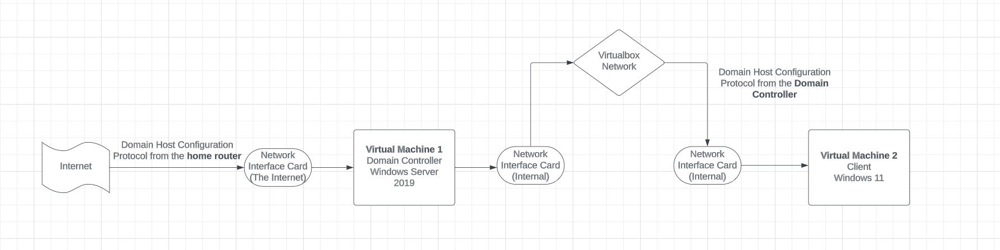
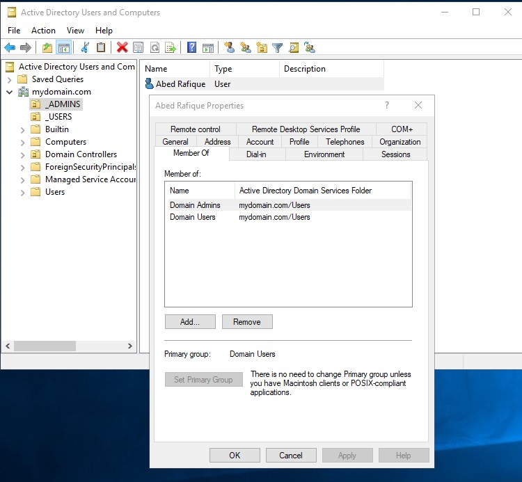
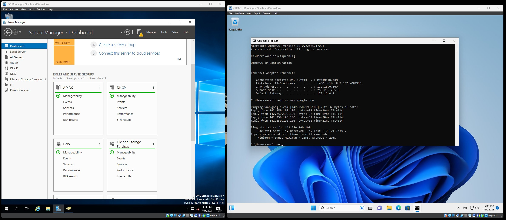

# homeLab

This repository is a demo of running an Active Directory Home Lab using Virtualbox. 

# Software/Downloads
* [Virtualbox](https://www.virtualbox.org/)
* [Windows 11 ISO](https://www.microsoft.com/software-download/windows11)
* [Windows Server 2019 ISO](https://www.microsoft.com/en-us/evalcenter/download-windows-server-2019)

# Blueprint for the project

# Process
1) Create the first Virtual Machine(VM). This is named Domain Controller(DC) which will host the Active Directory.
   
   Contains 2 network adapters.
   * One to connect to the outside internet. In this scenario, it will connect to our home router to get internet access.
   * Second network adapter will connect to the virtualbox private network for the clients in Virtual Machine(VM) 2.
2) Install Microsoft Server 2019 and apply IP addressing for the internal network. As mentioned before, the external network automatically gets an IP address from our router.
   * Second network adapter will require manual IP address setup (in this lab the range is 172.16.0.100-200).
   * Identify internal network and setup IP address and DNS server address.
   * Server will use itself as a DNS server, so using (127.0.0.1) as a loopback address is fine. Entering its own IP address is also fine (172.16.0.1).

   
3) Setup Active Directory and create the Domain.
   * This should create a default admin account. For best practice, create another dedicated admin account.
   
4) Setup NAT and Routing so clients can get internet through the Domain Controller(DC).
   
5) Run a [powershell script](scripts/1_CREATE_USERS.ps1) to create a bunch of generic users or use your own method. All of them are assigned the same password for this demo.
   
   Here are all the server roles in after setup is complete:
   
7) Create the second Virtual Machine(VM). All the created users should be able to log into this machine under the new domain.
   
8) Run ipconfig and ping www.google.com to test connectivity.
   
